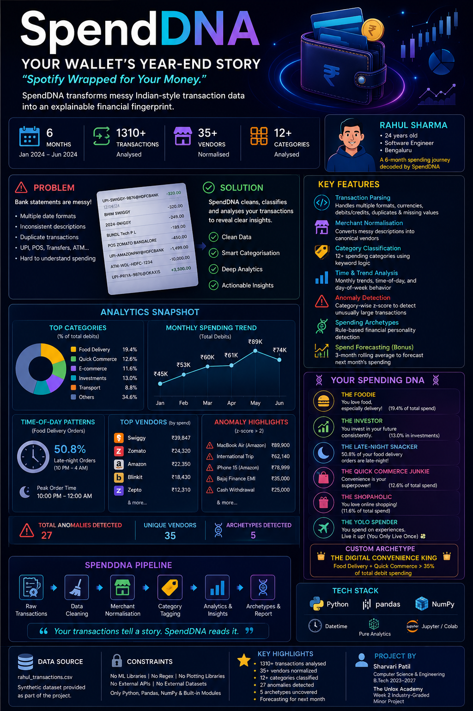
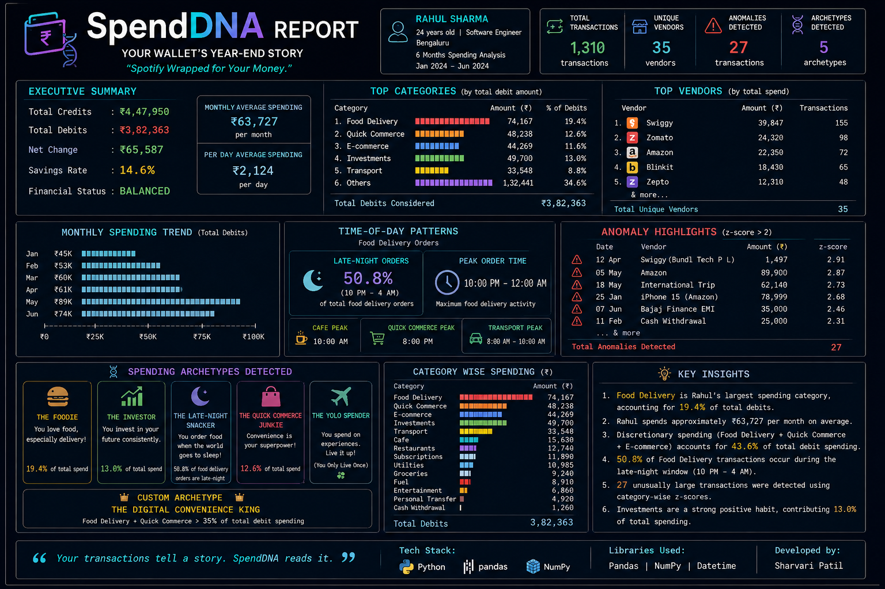

# SpendDNA
Python fintech analytics tool for decoding spending patterns, anomalies and financial personality from Indian transaction data.
## 🎨 SpendDNA 

> ### **From raw transactions to a complete financial fingerprint.**
>
> SpendDNA turns messy Indian-style transaction data into a clean, screenshot-ready fintech analytics report.

---

### 🧬 Project Poster

<p align="center">
  
</p>

<p align="center">
  <b>SpendDNA — Your Wallet's Year-End Story</b><br>
  <i>Spotify Wrapped for your money.</i>
</p>

---

### 📊 Final Analytics Report

<p align="center">
  
</p>

<p align="center">
  <b>Final SpendDNA Report</b><br>
  Executive Summary • Category Analysis • Vendor Insights • Time Patterns • Anomalies • Archetypes
</p>

---

### 🔍 What the Report Reveals

| 🧩 Analysis            | 💡 Insight                                              |
| ---------------------- | ------------------------------------------------------- |
| 💰 Spending Overview   | Total credits, debits, savings rate and net change      |
| 🏪 Vendor Analysis     | Top merchants and transaction frequency                 |
| 🗂️ Category Analysis  | Spending distribution across financial categories       |
| 📅 Monthly Trends      | Month-by-month spending behaviour                       |
| 🕐 Time Patterns       | When spending happens during the day                    |
| 🚨 Anomaly Detection   | Unusually large category-wise transactions              |
| 🧬 Spending Archetypes | Quantitative financial personality labels               |
| 🔮 Forecasting         | Three-month rolling average based next-month projection |

---

### 🧠 The SpendDNA Pipeline

```text
                 RAW TRANSACTIONS
                        │
                        ▼
              🧹 DATA CLEANING
                        │
                        ▼
            🏪 MERCHANT NORMALISATION
                        │
                        ▼
             🗂️ CATEGORY CLASSIFICATION
                        │
             ┌──────────┼──────────┐
             ▼          ▼          ▼
          📅 MONTHLY   🕐 TIME    🚨 ANOMALY
           TRENDS     PATTERNS    DETECTION
             │          │          │
             └──────────┼──────────┘
                        ▼
              🧬 SPENDING ARCHETYPES
                        │
                        ▼
                📊 SpendDNA REPORT
```

---

### 💳 Financial Fingerprint

SpendDNA doesn't just answer **"How much did Rahul spend?"**

It answers:

> **Where did the money go?**
> **Who received it?**
> **When did he spend it?**
> **Which transactions look unusual?**
> **What does his spending behaviour say about him?**

That combination creates a **financial fingerprint** from ordinary transaction data.

---

### 📸 Screenshot-Ready Output

The final report is intentionally designed as a **text-based fintech-style dashboard** so that the complete analysis can be captured in a single screenshot without relying on external visualization libraries.

**No Matplotlib. No Seaborn. No ML. Just Python + Pandas + NumPy.**
